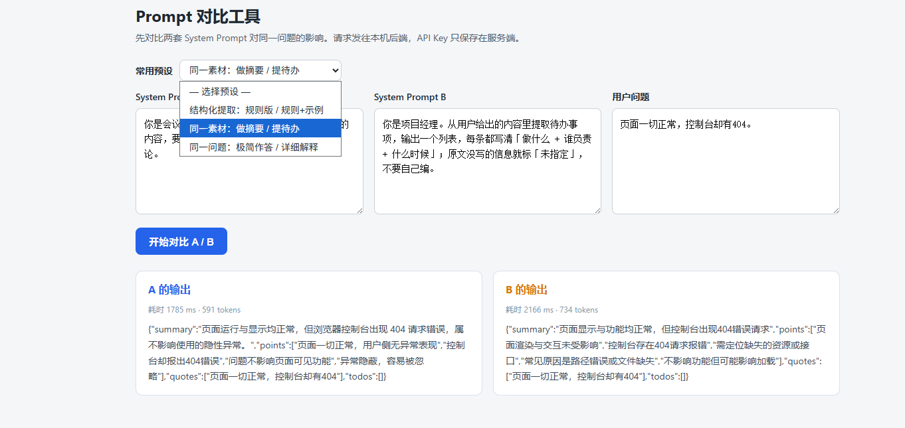
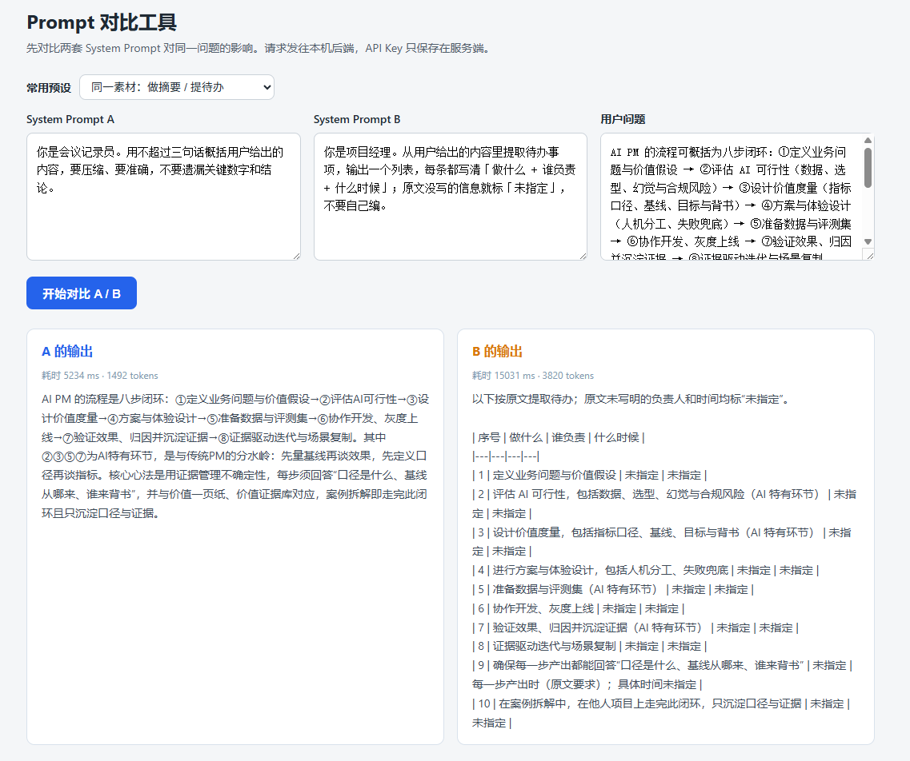

# Vibe-lab

我的 VibeCoding 训练仓库 —— 记录一个零代码 AI 产品经理从 0 开始的实操过程。

## 这是什么

我的零代码基础AI练习仓库

## 怎么运行

本页面是纯静态网页，**无需安装任何依赖、无需构建**。只需本机装有 Python 3（终端执行 `python -V` 能输出版本号即可）。

```bash
cd Vibe-lab
python -m http.server 8777
```

启动成功后，浏览器打开：

<http://localhost:8777>

点击页面上的按钮，数字加 1。验证完在终端按 `Ctrl+C` 停止服务。

### Prompt Playground（W2 起的工具）

`prompt-playground/` 是一个用来**并排对比两套 system prompt 对同一段素材的输出**的小工具。
它跟 W1 那个静态页不同 —— **它要调用模型**，所以需要一个小后端（Node 内置模块写的，零第三方依赖）。

**1. 在仓库根放一个 `.env` 文件**（**这个文件不要提交**，`.gitignore` 第一行已经写了 `.env`）：

```
DEEPSEEK_API_KEY=你的密钥
```

**2. 启动后端并打开页面：**

```bash
cd prompt-playground
node server.mjs
```

<http://localhost:3000>

> ⚠️ **Key 只放在服务端。** 浏览器请求的是**自己的后端** `/api/chat`，由后端带 Key 转发给模型 ——
> 所以在前端源码里搜不到密钥，也搜不到模型厂商的域名（这是 W2 最重要的一条验收）。
> ⚠️ 与 W1 的静态页不同：**改 `server.mjs` 必须重启**（`Ctrl+C` → 重新 `node server.mjs`）；只改 `index.html` 刷新浏览器即可。

## 我遇到的坑

改自己写的页面时踩到的，按"信号强度"排：

1. **点了按钮没反应，控制台一堆红字** —— `getElementById("count")` 里 id 拼成了 `conut`，
   找不到元素，`null` 上取属性就崩。教训：**报错是代码被执行到才发生的**，不点按钮不报。
2. **页面一切正常，控制台却有 404** —— head 里引了一个不存在的 `style.css`。
   教训：红字要分级，**404 不一定影响功能**，先看页面再决定修不修。
3. **颜色突然没了，控制台却干干净净** —— 行内 style 属性名拼错（`background` 写成了 `backgr`），
   浏览器直接丢弃这条不认识的属性。教训：**不报错 ≠ 没问题**，这类最难的只能靠比对。
4. **F5 刷新后数字变回初始值** —— `let count` 只活在本次页面加载里，刷新即重跑。
   教训：**「显示」和「记忆」是两回事**，要让数据活着，得存到页面外面去。
5. **命令敲完什么都没显示** —— `git add` 静默、`git commit` 说 `nothing to commit`、
   `git push` 说 `Everything up-to-date`，三条加起来看着都"正常"，**其实一步都没生效**。
   教训：**没有输出 ≠ 成功**，唯一可靠的判断是看结果（`git log --oneline -3` 数条数、比哈希）。

## W1 复盘（2026-09-16 ~ 09-19）

这周学到最有用的两件事：一是**走通了 GitHub 的完整流程**（改文件 → 提交 → 推送 → 验证），
二是**摸清了本地运行环境** —— `PowerShell`、`Node`、环境变量这些以前只听过的东西，现在能看懂、能查。

最卡的是 **Git 的操作步骤**。之前完全没碰过，一周下来敢自己动手了。
判断方式也变了：**不一定要会修，但要知道问题出在哪一层**。

对 VibeCoding 的看法同样调整了：**环境重要，但它是前提、不是目的** ——
能自己配固然好，配不动时可以让 AI 接手，现阶段的精力应该放在**实战**上。

> **埋点 ①**：一条"什么都没显示"的命令，到底是**成功了**还是**根本没执行**？
> 这周撞了 4 次同族：`cp` 忘加 `-Recurse`（静默得空目录）、`git restore` 输入被截断（静默留下垃圾文件）、
> `git add` 无改动仍静默、`git commit` 空提交。
> 线索：先看**结果**（`git status` / `git log --oneline -1` / 目录列表），再往后可以看**退出码**。


## W2 复盘（2026-09-20 ~ 09-26）

这周从「能改页面」进到「**能让页面调用模型**」：学了 messages 的三种角色、跑完参数实验、写出能稳定输出 JSON 的 prompt，
最后做成一个**能并排对比两套提示词的工具**，并且**把 API Key 关在了服务端**。

### 我做的工具：Prompt Playground



- 上方三个输入框：System Prompt A / System Prompt B / 用户问题
- 「常用预设」下拉：一键灌入三套常用组合，省去每次手打
- 点「开始对比 A / B」→ **两次请求并发发出**（`Promise.all`），结果并排显示
- 每张卡片上标出这次调用的**耗时**和**消耗的 token** —— 调用要看得见，才知道钱花在哪

### D3 参数实验：三个旋钮各管什么

| 旋钮 | 它真正管什么 | 实测证据 | 怎么用 |
|---|---|---|---|
| `temperature` | **复现性 / 思考量波动**，不管对错 | 同题 `0` 跑 3 次：reasoning 占比 77.2 / 77.4 / 78.2%（极差 **1.0 pp**）；`1.5` 跑 3 次：71.2 / 78.3 / 86.5%（极差 **15.3 pp**）—— **但 6 次的实质答案完全一致** | 结构化输出压 **0–0.3**；起名、文案给 **0.8–1.5** |
| `max_tokens` | **总输出额度**，`reasoning` 从里面扣 | 设 `20` 和 `2000` 两次，**正文都是 0 字**（reasoning 吃掉 100%）；`2000` 那次的截断率 **2/5 = 40%** | 想要 N 字正文就给 **4–5 × N**，并且**必须检查 `finish_reason === 'length'`** |
| `stream` | 换「**首字延迟**」，代价是「**总流量**」 | 首字立刻开始滚；但原始帧 ≈ **300 字符 / 每 token**（1,053,798 字符 ↔ 3,528 token） | **人在等**（对话、长文）用它；**机器在等**（批处理、后接 JSON 解析）别用 |
| 缓存 | **不自动省钱** | 12 次请求、内容一字不差，命中 **0 / 12** | 别指望「重复发同样内容」能省钱 |

### D4 结论：最稳定的 JSON 写法

- **分水岭在「写清字段规范」，不在「给示例」**：裸 prompt 出合法 JSON **0/2** → 强约束（字段规范 + 显式禁 markdown）**7/7** → 再加 few-shot **6/6**。
- **最稳的写法 = system 强约束 + `temperature: 0`**，而且不引入新风险。few-shot **不是达标的必要条件**（代价是 +104 prompt token）。
- 🚨 **示例污染**：示例素材必须与真实素材「**零语义重叠**」—— 实测把示例里的句子抄进了真实输出 1 次，换成园艺示例后污染消失 3/3。
- **「格式对齐 ≠ 内容对齐」**：结构 100% 合法，字段内容照样可能被改写 ⇒ 判据必须两层（**结构 + 内容**），而且比对对象必须是**磁盘原文**，不能凭记忆。
- **`prompt` 锁得住「写多少字」，锁不住「想多久」**：正文稳定在 184–264（±18 %），`reasoning` 却在 0–563 乱跳 ⇒ **成本的不确定性来自推理，不来自输出长度**。

### D7 对比实验：同一段素材，两种 system

同一段素材（我自己整理的「AI PM 八步闭环」），只换 system prompt：



| | A：会议记录员（做摘要） | B：项目经理（提待办） |
|---|---|---|
| 耗时 | **5,234 ms** | **15,031 ms** |
| tokens | **1,492** | **3,820** |
| 输出形态 | 一段三句话的连贯叙述 | 一张 10 行 × 4 列的表（序号 / 做什么 / 谁负责 / 什么时候） |

**我观察到 system prompt 是这样影响输出的：**

1. **它决定的是「任务的形状」，不只是语气。** 同一段素材，A 在**压缩**（挑主旨），B 在**清点**（挑动作项）—— 一个 system 换掉，模型看到的就是两份不同的文档。
2. **约束写清楚，模型真的会守。** A 的 system 写了「不超过三句话」，输出正好 3 句；B 的 system 写了「原文没写的信息就标『未指定』，不要自己编」——
   10 行里 20 个字段**全部标了「未指定」，一处都没编**。
   ⇒ 这条直接对应我在做的防幻觉：**给模型留一个「我不知道」的出口，比逼它填满更安全。**
3. **成本差 2.6 倍，差在「输出形态」上，不在「想得久」。** B 贵是因为格式本身就长 —— 表里的「未指定」是原文没有、**但格式要求的填充位**。
   ⇒ 先想清楚**要表还是要话**，再写 system：**输出格式是成本的第一杠杆。**
4. **两个副作用都是「没禁就等于允许」**：B 自动加了句开场白（system 没禁前言），还自动用了 markdown 表格（system 只说「输出一个列表」）。
   ⇒ 想要干净输出要**显式禁开场白**；想要机器能解析要**显式禁 markdown** —— 否则格式会被模型自己「发挥」。

### 这周最值钱的三个坑

1. **`<textarea>` 里的换行和空格是「内容」，不是「排版」** —— 为了对齐缩进敲进去的 10 个空格，会**原样跟着进 prompt**。
   看不见的差异只能用程序数出来（`行首带空格 = 0`），不能靠眼睛。
2. **程序判据有两个维度：层（结构 / 内容）+ 范围（里面 / 外面）** —— 判据只看 `<textarea>` 里面，就发现不了残留在框外的垃圾。
3. **「没有后悔药」是字面事实** —— 一个未跟踪的新文件被删掉后，git 里查无此物、全盘找不到，
   最后是靠编辑器的本地历史快照救回来的。**动手改未跟踪文件之前，先提交或先备份。**

> **埋点 ②**：`EADDRINUSE` 报「3000 已被占用」，可 5 分钟后我打验证，得到的却是「没有服务在监听」。
> 那到底是谁占了它？又是什么时候消失的？为什么两次结论相反？
> 线索：报错描述的是**那一刻**的状态，不是**现在**的状态 —— **排查的第一步永远是重新量一次现场**。

## 下一步做什么

打造个人工作台
从当前工作接入AI能力，引申working场景
